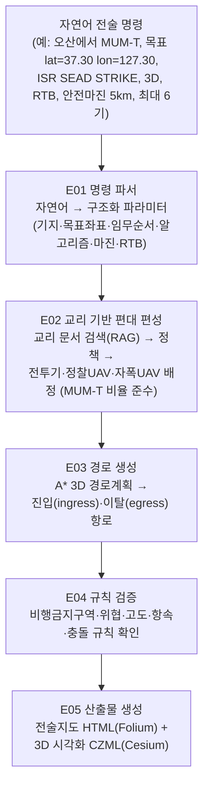

# IMPS: 유무인 협업 임무계획 통합 시뮬레이션 환경

> Integrated Mission-Planning Simulation environment for Manned-Unmanned Teaming

JKSS 투고 논문 *"유무인 복합운용 임무계획 시뮬레이션의 교차모듈 정합성 점검
(Assessing Cross-Module Consistency in Manned-Unmanned Teaming Mission-Planning
Simulation)"* 의 구현 검증(reproducibility) 패키지입니다.

IMPS는 지휘관의 자연어 전술 명령 한 줄을 받아서, 교리에 근거한 편대 편성, 3차원
경로 계획, 규칙 검증을 거쳐 전술지도와 3D 시각화 산출물까지 자동으로 만들어내는
임무계획 파이프라인입니다.

**데모 영상**: <https://youtu.be/RTxvAQh6CWM>

---

## 1. 이 저장소가 검증하는 것 (범위)

이 저장소는 논문에 보고된 **구현 검증** 진입점입니다.

- **E20**: 14개 모듈 계약(contract)·회귀(regression) 시험
- **E21**: 6단계 합성(synthetic) 종단(end-to-end) 워크플로

이 시험들은 구현이 논문 서술대로 계산하는지를 확인합니다. 실제 작전 임무의 품질이나,
실측 방공 자료에 대한 위협 모델의 타당성을 검증하지는 **않습니다.** 즉 "코드가 설계대로
동작하는가"를 보이는 것이지 "이 임무계획이 실전에서 옳은가"를 주장하지 않습니다.

---

## 2. 처리 흐름: 명령 입력에서 산출물까지

자연어 명령 한 줄이 다음 5단계를 거쳐 산출물이 됩니다. E21 종단 시험이 이 전 과정을
그대로 실행합니다.



| 단계 | 하는 일 | 핵심 모듈 |
|---|---|---|
| E01 | 자연어 명령을 파라미터로 파싱 | `llm_brain.py` |
| E02 | 교리 검색 후 편대 편성 (MILP + 헝가리안) | `doctrine_rag.py`, `doctrine_policy.py`, `formation_optimizer.py` |
| E03 | A* 기반 3D 경로 계획 | `pathfinder_optimized.py`, `path_computer.py` |
| E04 | 임무 규칙 검증 | `validator.py` |
| E05 | 전술지도·CZML 출력 | `map_renderer.py`, `czml_exporter.py` |

**명령 파서의 두 경로.** E01은 두 가지 방식으로 명령을 해석합니다.

- **결정론 규칙 라우터** (`fast-rule`): Ollama 없이 동작하는 기본 경로. 같은 명령은
  항상 같은 결과를 냅니다. **재현 시험(E20/E21)은 이 경로만 사용합니다.**
- **생성형 LLM 라우터** (qwen, Ollama): 전체 애플리케이션에서 지명 해석이나 유연한
  문장 이해가 필요할 때 쓰는 경로. 이 저장소의 재현 시험 범위에는 포함되지 않습니다.

---

## 3. 실행 방법

IMPS는 두 가지로 실행합니다. 임무를 직접 계획해 보려면 3-1의 GUI를, 논문 결과를
재현하려면 3-2의 검증 실행을 사용하십시오.

### 3-0. 준비 (처음 한 번)

1. **Python 3.13** (검증 환경: 3.13.5)과 **Git**을 설치합니다.
2. **Git LFS**를 설치합니다(<https://git-lfs.com>). 교리 PDF는 Git LFS로 저장되어 있어,
   LFS 없이 받으면 PDF 대신 짧은 안내 파일만 내려옵니다. GitHub의 "Download ZIP"도
   같은 문제가 있으므로 반드시 `git clone`으로 받으십시오.
3. Windows에서는 긴 파일 이름 오류("Filename too long")를 막기 위해 한 번 설정합니다.
   ```bash
   git config --global core.longpaths true
   ```
4. 저장소를 받고 가상환경을 만듭니다.
   ```bash
   git lfs install
   git clone https://github.com/dodo-port/imps.git
   cd imps
   python -m venv .venv
   ```
   가상환경 활성화: Windows는 `.venv\Scripts\activate`, macOS/Linux는
   `source .venv/bin/activate`.

### 3-1. 대화형 GUI (사람이 직접 계획할 때)

```bash
python -m pip install -r mission_plan-new_plan_250519/requirements.txt
cd mission_plan-new_plan_250519
streamlit run run.py
```

브라우저가 열리면 왼쪽 사이드바에 세 화면이 나타납니다.

- **IMPS 임무계획**: 좌측 패널에서 운용 기지, 목표 좌표, 임무 유형(전술 통제),
  위협(위협 관리), 편대 구성을 설정합니다. 채팅창에 자연어 명령을 입력하면 파라미터가
  실시간으로 바뀌고, 오른쪽에 전술 지도와 경로 위험도 분석이 갱신됩니다.
- **작전 타임라인**: 편대별 진입·이탈 경로를 시간축으로 재생합니다.
- **시나리오 비교**: 파라미터가 다른 두 계획을 나란히 비교합니다.

이 배포로 clone하면 GUI가 그대로 켜집니다. 다만 아래 데이터·서버는 선택 사항입니다.

- **지형 데이터(SRTM)와 3D 기체 모델**은 용량 문제로 이 배포에서 제외돼 있습니다.
  없으면 자동으로 평면(가상) 지형으로 대체됩니다. 2D 전술 지도와 경로·편대·검증은
  완전히 동작합니다. 실제 지형을 쓰려면:
  1. CGIAR-CSI SRTM 90m v4.1(<https://srtm.csi.cgiar.org>)에서 한반도 타일
     `srtm_62_05`(북위 35~40°)와 `srtm_62_06`(북위 30~35°)의 GeoTIFF를 받습니다.
  2. 압축을 풀어 `.tif` 파일을 `mission_plan-new_plan_250519/data/terrain/`에 넣습니다.
  3. `python -m pip install rasterio`로 지형 읽기 패키지를 설치합니다.
- **Ollama 서버(선택)**가 있으면 생성형 명령 해석을, 없으면 결정론 규칙 해석을
  사용합니다. 둘 다 명령 채팅이 동작합니다. 생성형 해석을 쓰려면 Ollama
  (<https://ollama.com>)를 설치하고 논문과 같은 모델을 받습니다.
  ```bash
  ollama pull qwen3:14b
  ```
  앱은 `qwen2.5:7b`가 설치되어 있으면 그것을 먼저 시도하고, 없으면 `qwen3:14b`를
  사용합니다.
- **Cesium Ion 토큰(선택)**: 3D 위성 지형 타일에만 쓰입니다. 없어도 GUI와 재현 시험은
  모두 동작하며, 3D 화면은 기본 지도로 대체됩니다. 3D 지형을 쓰려면:
  1. <https://ion.cesium.com> 에 가입(무료)한 뒤 **Access Tokens**에서 토큰을 만듭니다.
  2. 실행 전에 환경변수로 넣습니다.
     - PowerShell: `$env:CESIUM_ION_TOKEN="발급받은_토큰"`
     - macOS/Linux: `export CESIUM_ION_TOKEN="발급받은_토큰"`
  3. 같은 창에서 `streamlit run run.py`를 실행합니다.

  토큰을 코드나 파일에 적어 커밋하지 마십시오.
- **"3D 시뮬레이션 시작"은 로컬 실행 전용입니다.** 이 기능은 로컬 브라우저를
  띄우는 방식이라 클라우드 호스팅(예: Streamlit Community Cloud)에서는 동작하지
  않으며, 그 환경에서는 버튼이 비활성화됩니다. 로컬에서 `streamlit run run.py`로
  실행하면 3D 뷰어가 열립니다. 대안으로 Steer Point List의 'CZML 다운로드'를 받아
  Cesium Sandcastle(cesium.com/sandcastle)에서 볼 수 있습니다.

### 3-2. 재현 검증 (논문 결과 재현)

```bash
python -m pip install -r reproducibility/requirements-lock.txt
python reproducibility/run_checks.py
```

`run_checks.py`는 E20을 먼저, E21을 이어서 실행하고 결과와 해시를
`experiments/E20_pipeline_contract_verification/` 및
`experiments/E21_end_to_end_verification/` 아래에 기록합니다.

- 검증에 필요한 패키지는 7개이며, `requirements-lock.txt`에 결과를 만든 환경의 정확한
  버전을 적었습니다. 범위만 지정한 `reproducibility/requirements.txt`도 있으나, 논문과
  같은 결과를 확인하려면 lock 파일을 쓰십시오.
- 실행 전에 준비 상태를 자동으로 확인합니다. 교리 PDF가 Git LFS로 내려받아지지 않았거나,
  PuLP에 최적화 계산기(CBC)가 없으면(PuLP 4.x) 시험을 시작하지 않고
  `[SETUP ERROR]`로 해결 방법을 알려 줍니다.
- 실행할 때마다 결과 파일의 실행 시각(`generated_at_utc`, CZML 시각), 계산 시간
  (`*_ms`, `runtime_s`), 전술지도 HTML의 내부 요소 ID는 달라집니다. 새 가상환경에
  lock 파일로 설치했다면 판정 결과, 수치 결과, 프로토콜 해시(`protocol_sha256`)는
  저장소에 있는 결과 파일과 같아야 합니다. 다른 패키지가 함께 깔린 환경(예: PDF 글꼴
  패키지 `fontTools`)에서는 교리 검색 점수가 소수 넷째 자리에서 달라질 수 있습니다.
- Ollama 서버, Cesium 토큰 모두 필요 없습니다. E01은 결정론 규칙 라우터로 동작합니다.
- E21은 공개 교리 PDF를 색인하므로 보고된 워크스테이션 기준 약 1분 걸립니다.

자세한 예상 출력과 프로토콜 SHA-256 기록은 `reproducibility/README.md`를 보십시오.

---

## 4. 직접 명령을 넣어 돌려보기

파이프라인이 실제로 어떻게 반응하는지 보려면, E21과 같은 모듈을 사용해 명령만 바꿔
실행할 수 있습니다. 저장소 루트에서 아래 스크립트를 저장하고 실행하십시오.

```python
import sys
from pathlib import Path

APP = Path("mission_plan-new_plan_250519").resolve()
sys.path.insert(0, str(APP))

from modules.llm_brain import LLMBrain

# ── 여기만 바꿔서 실험하십시오 ─────────────────────────────
command = (
    "오산에서 MUM-T 임무. 목표 lat=37.30 lon=127.30. "
    "ISR SEAD STRIKE, 저고도 3D, RTB, 안전마진 5km, 최대 6기."
)
# ─────────────────────────────────────────────────────────

state = {
    "target_lat": 39.0, "target_lon": 125.7, "start": "오산(Osan)",
    "algorithm": "A*", "margin": 5.0, "stpt_gap": 5,
    "enable_3d": False, "rtb": False, "fuel_state": 1.0,
    "refuel_count": 0, "extra_targets": [],
}

parsed = LLMBrain().parse_tactical_command(command, state, current_threats=[])

print("라우터:", parsed.get("_model_used"))       # 결정론 경로면 'fast-rule'
print("동작:", parsed.get("action"))               # MISSION_PLAN 등
print("임무 순서:", parsed.get("mission_sequence")) # ['ISR', 'SEAD', 'STRIKE']
print("변경 파라미터:", parsed.get("update_params"))
```

E01의 파싱 결과를 편대 편성, 경로 생성, 산출물까지 이어서 실행하는 전체 예시는
`experiments/E21_end_to_end_verification/run_e2e.py`가 그대로 참고 코드가 됩니다.
그 파일 상단의 `COMMAND` 문자열만 바꿔도 종단 실행을 재현할 수 있습니다.

### 입력 명령 예시

결정론 규칙 라우터에서 아래 문장들이 인식됩니다. 국문·영문을 섞어 써도 됩니다.

| 명령 예시 | 파서가 뽑아내는 것 |
|---|---|
| `오산에서 MUM-T 임무, 목표 lat=37.30 lon=127.30, ISR SEAD STRIKE, 최대 6기` | 기지=오산, 목표좌표, 임무순서=ISR→SEAD→STRIKE, 편대 상한 6 |
| `저고도 지형추종으로 레이더 회피` | `enable_3d=true`, `algorithm="A* 3D"` |
| `빠르게 직선으로` | `algorithm="A*"` |
| `타격 후 복귀 (RTB)` | `rtb=true` |
| `안전마진 15km로 우회` | `safety_margin_km=15` |
| `목표 부근에 SAM 하나 추가` | 위협(SAM) 1개 추가, 기본 반경 30km |
| `공중급유 1회` | `refuel_count=1` |

> 결정론 경로에서는 목표를 **좌표(lat/lon)로 명시**하는 것이 확실합니다. "평양",
> "함흥" 같은 지명 → 좌표 해석은 생성형 LLM 라우터(Ollama)에서 동작합니다.

### 명령에서 쓸 수 있는 값

- **출발 기지** (12개): 서산, 오산, 원주, 강릉, 충주, 청주, 대구, 광주, 부산, 수원,
  사천, 서울
- **임무 유형**: ISR(정보·감시·정찰), SEAD(적 방공망 제압), STRIKE(공중 타격),
  CAS(근접항공지원). 여러 개면 ISR → SEAD → STRIKE 순으로 정렬됩니다.
- **안전마진**: 최소 2km, 표준 5km, 안전 15km, 최대 30km
- **알고리즘**: `A*`, `A* 3D`, `RRT`, `RRT*`
- **위협**: SAM(기본 30km), RADAR(기본 80km), NFZ(비행금지구역)

---

## 5. 산출물

E21 실행 후 다음이 생성됩니다.

| 파일 | 내용 | 보는 법 |
|---|---|---|
| `experiments/E21_.../result.json` | 6단계 각 시험의 기대값·관측값·통과 여부 | 텍스트 편집기 |
| `experiments/E21_.../summary.txt` | PASS/FAIL 요약 | 텍스트 편집기 |
| `experiments/E21_.../outputs/synthetic_tactical_map.html` | 편대별 진입·이탈 항로가 그려진 전술지도 | 웹 브라우저 |
| `experiments/E21_.../outputs/synthetic_mission.czml.json` | 시간축을 가진 3D 임무 시각화 데이터 | Cesium 뷰어 |

`result.json`에는 프로토콜 SHA-256 해시가 함께 기록됩니다. E20은 각 회귀 사례의 출처와
실행 이력도 남깁니다.

---

## 6. 포함 범위와 제외된 데이터

이 저장소는 **대화형 GUI, 소스 모듈, 검증 스크립트**를 포함합니다. 용량과 재배포
권리 문제로 다음 대용량 데이터는 제외했으며, 없으면 앱이 자동으로 대체 경로로
동작합니다(`.gitignore` 참고).

- `data/terrain/` (SRTM 지형): 없으면 평면 지형으로 대체
- `data/models/` (3D 기체 .glb 모델): 없으면 3D 기체 표시만 생략

2D 전술 지도, 편대 편성, 경로 계획, 규칙 검증, 명령 채팅은 제외 데이터 없이 완전히
동작합니다. (`requirements.txt`에 있는 `earthengine-api`, `geemap`는 현재 코드에서
사용하지 않으므로 설치되지 않아도 됩니다.)

### 교리 검색 색인

교리 검색(`doctrine_rag.py`)은 `data/doctrine/` 바로 아래의 공개 문서 11종을 색인합니다.
연구팀이 작성한 요약문서 `doctrine_basis.md`를 제외하면 3,554개 청크이며, 논문 3.3절의
구성과 같습니다. `data/doctrine/ato_refs_2026/` 하위 문서는 참고용이며 색인 대상이
아닙니다. 문서별 출처와 재배포 조건은 `THIRD_PARTY_NOTICES.md`에 정리했습니다.

---

## 7. 저장소 구성

| 경로 | 내용 |
|---|---|
| `mission_plan-new_plan_250519/run.py` | GUI 진입점 (`streamlit run run.py`) |
| `mission_plan-new_plan_250519/streamlit_app.py` | 임무계획 메인 화면 |
| `mission_plan-new_plan_250519/pages/` | 작전 타임라인, 시나리오 비교 화면 |
| `mission_plan-new_plan_250519/modules/` | 소스 코드 |
| `mission_plan-new_plan_250519/data/doctrine/` | E21 검색용 교리 문서 (서드파티, 아래 참고) |
| `experiments/E20_*`, `experiments/E21_*` | 검증 스크립트, 입력, 기대 결과, 프로토콜 |
| `reproducibility/` | 원커맨드 실행기, 체크리스트, 환경 안내 |

---

## 8. 라이선스

소스 코드는 **MIT License**로 배포됩니다(`LICENSE` 참고). MIT License는 소스 코드에만
적용됩니다. `mission_plan-new_plan_250519/data/doctrine/` 아래 문서는 각자의 조건으로
재배포되는 서드파티 저작물입니다. `THIRD_PARTY_NOTICES.md`를 보십시오.
